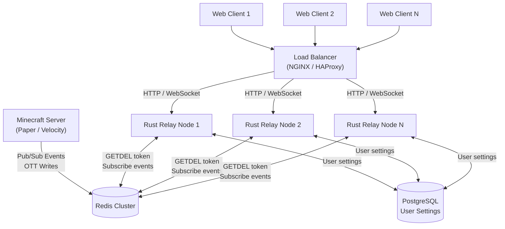
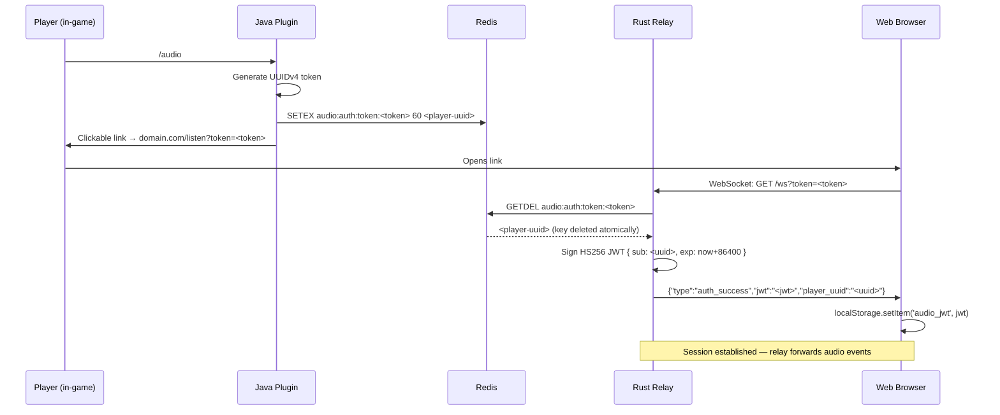

# AudioServer 2.0

A high-performance, microservices-based alternative to OpenAudioMc for Minecraft — providing 3D spatial audio, WebRTC voice chat, and modular hardware integrations (e.g. Philips Hue) synced with in-game events.

---

## Architecture Overview

AudioServer 2.0 is designed for horizontal scalability across large proxy networks.

- **Minecraft servers (Paper / Velocity)** act purely as telemetry clients, pushing state to a central Redis cluster. They do **not** host audio sessions.
- **Rust relay nodes** are stateless WebSocket servers. Any number of them can sit behind a load balancer; all transient state (auth tokens, active sessions) lives in Redis.
- **Redis** is the shared data bus — both for OTT tokens and for Pub/Sub event routing.
- **PostgreSQL** (Phase 2) holds durable user settings, never session state.

### Multi-Node Load Balancing



> **Key insight:** Because every relay node reads/writes Redis for all state, you can add or remove
> nodes with zero downtime. A JWT signed by node A is valid on node B because all nodes share
> the same `JWT_SECRET` environment variable.

---

## OTT Authentication Flow



---

## Tech Stack

| Layer | Technology |
|-------|-----------|
| Relay engine | Rust · `axum` 0.8 · `tokio` · `deadpool-redis` |
| Data bus | Redis 7+ (Pub/Sub + key-value) |
| Minecraft plugin | Java 25 · Paper API · Incendo Cloud v2 · Jedis 5 |
| Lite web client | SvelteKit 2 (Svelte 5) · `adapter-static` · `howler.js` |
| Pro portal | Next.js 16 · React 19 · TypeScript · Tailwind CSS v4 |
| Persistent storage (Phase 2) | PostgreSQL |

---

## Project Structure

```
AudioServer2.0/
├── backend/                    # Rust/Axum stateless relay
│   ├── Cargo.toml
│   ├── .env.example
│   └── src/
│       ├── main.rs             # Entry point
│       ├── config.rs           # Env-var configuration
│       ├── router.rs           # Axum route definitions
│       ├── redis_pool.rs       # deadpool-redis pool setup
│       ├── auth/
│       │   ├── ott.rs          # OTT validation (GETDEL)
│       │   └── jwt.rs          # JWT sign / verify
│       └── ws/
│           └── handler.rs      # WebSocket upgrade + session
│
├── plugin/                     # Java 25 multi-module Gradle project
│   ├── settings.gradle         # Declares :common, :paper, :velocity
│   ├── build.gradle            # Shared toolchain (Java 25) + repos
│   │
│   ├── common/                 # Platform-agnostic shared library
│   │   └── src/main/java/dev/audioserver/
│   │       ├── dto/TokenPayload.java          # Immutable record DTO
│   │       ├── event/AudioEvent.java          # Sealed interface
│   │       ├── event/RegionEnterEvent.java
│   │       ├── event/AudioPlayEvent.java
│   │       └── redis/RedisManager.java        # Jedis pool, no platform dep
│   │
│   ├── paper/                  # Paper-specific plugin
│   │   └── src/main/java/dev/audioserver/
│   │       ├── AudioServerPlugin.java
│   │       ├── command/AudioCommand.java      # /audio — virtual thread dispatch
│   │       └── module/                        # AudioModule + ModuleRegistry
│   │
│   └── velocity/               # Velocity proxy-side plugin
│       └── src/main/java/dev/audioserver/velocity/
│           ├── AudioServerVelocityPlugin.java # @Plugin entry point
│           ├── command/VelocityAudioCommand.java
│           └── listener/PlayerEventListener.java  # connect/switch/disconnect → Redis
│
├── client-lite/                # Svelte 5 static web client
│   ├── svelte.config.js        # adapter-static
│   └── src/routes/+page.svelte # OTT → WS → JWT flow
│
├── portal/                     # Next.js 16 Pro Portal (server admins)
│   ├── proxy.ts                # Route protection (authed admin sessions)
│   ├── lib/
│   │   ├── api.ts              # Typed API client (health live, rest Phase 2 stubs)
│   │   ├── ws-types.ts         # TypeScript projection of docs/events.md contracts
│   │   └── auth.ts             # Admin JWT sign/verify (jose HS256 — Phase 1 placeholder)
│   ├── app/
│   │   ├── actions/auth.ts     # Server Actions: login (useActionState) + logout
│   │   ├── login/page.tsx      # Login page
│   │   └── (admin)/
│   │       ├── layout.tsx      # Admin shell with sidebar nav
│   │       └── dashboard/      # /dashboard — relay health + Phase 2 feature map
│   └── components/
│       ├── nav.tsx             # Sidebar navigation with Server Action logout
│       └── stat-card.tsx       # Reusable stat card
│
└── docs/
    └── events.md               # JSON payload contract schemas
```

---

## Quick Start

### 1. Redis

```bash
docker run -d -p 6379:6379 redis:7-alpine
```

### 2. Rust Relay

```bash
cd backend
cp .env.example .env
# Edit .env — set REDIS_URL and JWT_SECRET
cargo run
```

### 3. Java Plugin

```bash
cd plugin
./gradlew shadowJar
# Copy build/libs/AudioServerPlugin-*.jar to your Paper server's /plugins folder
```

Add to `plugins/AudioServer/config.yml`:

```yaml
domain: "https://audio.example.com"
redis:
  host: "127.0.0.1"
  port: 6379
```

### 4. Svelte Client

```bash
cd client-lite
npm install
npm run build
# Compiled output → client-lite/build/  (served by the Rust relay)
```

---

## Horizontal Scaling

To run multiple relay nodes, start each with the **identical** `JWT_SECRET` and `REDIS_URL`:

```bash
# Node 1
JWT_SECRET=shared-secret REDIS_URL=redis://redis:6379 BIND_ADDR=0.0.0.0:3001 cargo run

# Node 2
JWT_SECRET=shared-secret REDIS_URL=redis://redis:6379 BIND_ADDR=0.0.0.0:3002 cargo run
```

NGINX upstream example:

```nginx
upstream audio_relay {
    server 127.0.0.1:3001;
    server 127.0.0.1:3002;
}

server {
    listen 443 ssl;
    server_name audio.example.com;

    location / {
        proxy_pass http://audio_relay;
        proxy_http_version 1.1;
        proxy_set_header Upgrade $http_upgrade;
        proxy_set_header Connection "upgrade";
    }
}
```

---

## Documentation

| Document | Description |
|----------|-------------|
| [events.md](./docs/events.md) | JSON payload schemas for Redis Pub/Sub and WebSocket messages |

---

## Extensibility

Add new features by implementing [`AudioModule`](./plugin/src/main/java/dev/audioserver/module/AudioModule.java):

```java
public class TrainCartsModule implements AudioModule {
    @Override public String getId() { return "traincarts"; }
    @Override public void onEnable(AudioServerPlugin plugin) { /* register listeners */ }
    @Override public void onDisable() { /* cleanup */ }
}

// Register from your add-on plugin's onEnable:
AudioServerPlugin.getInstance().getModuleRegistry().register(new TrainCartsModule());
```
